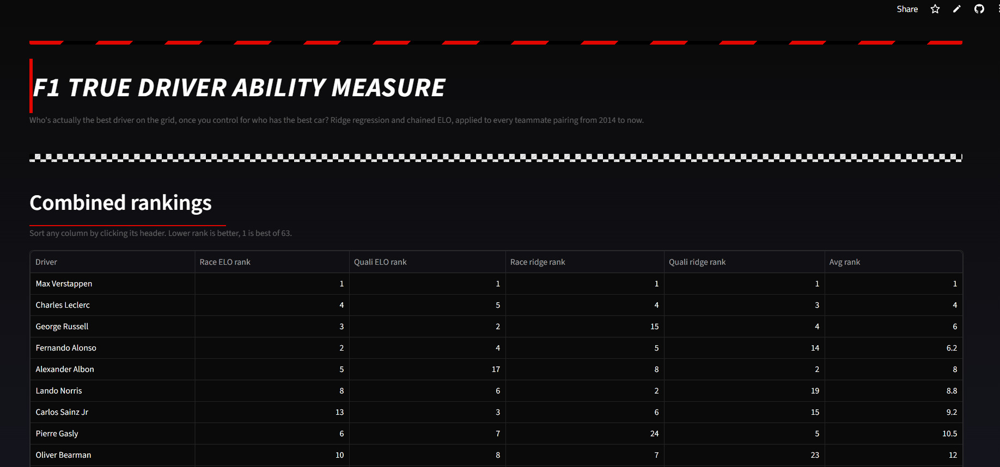
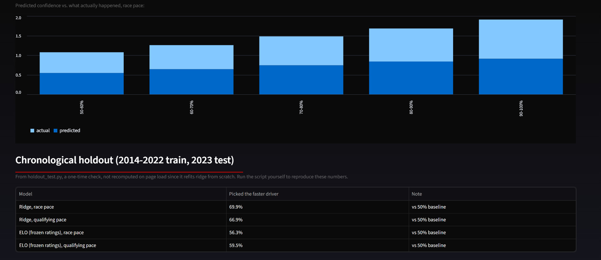
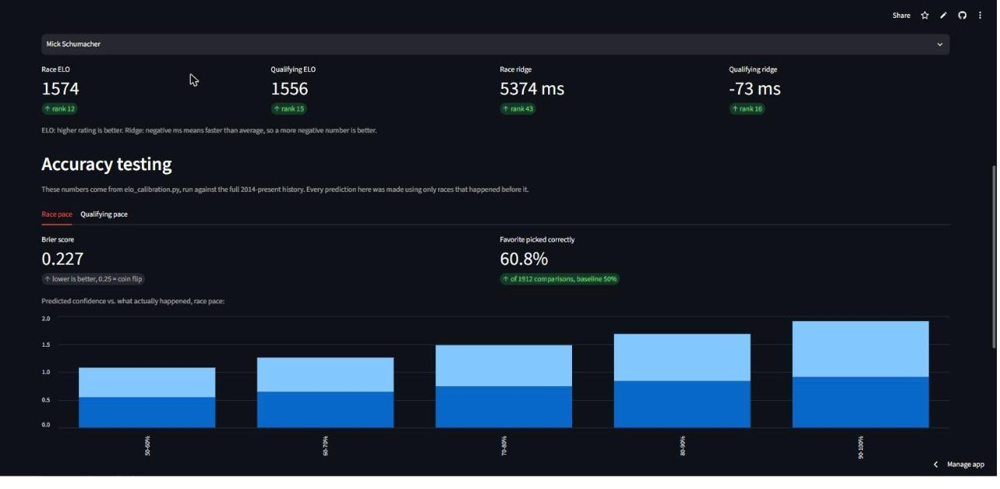

# F1 True Driver Ability Measure

A data analytics project that tries to separate F1 driver skill from car performance, using two independent statistical models cross-checked against each other, across twelve-plus seasons (2014-2026) of race data.

Who's actually the best driver on the grid, once you control for who has the best car? That's the question this project tries to answer.

Live app: [F1 True Driver Ability Measure](https://f1-driver-ability-ugknhet5rjtkmb79svqpw7.streamlit.app/)



---

## Quick Start

- Want to click around without downloading anything? Open the [live app](https://f1-driver-ability-ugknhet5rjtkmb79svqpw7.streamlit.app/). Sort the rankings, look up a driver, check the accuracy numbers.
- Want the results as a spreadsheet? Open `F1_Driver_Rankings_2014_present.xlsx`. The Combined sheet ranks all 63 drivers across all four models, and each model also has its own detail sheet.
- Want to run the pipeline yourself? See Reproducing the analysis below.
- Want the full write-up? Keep reading.

---

## Scope

- Drivers covered: every F1 driver who raced 2014-2026 (63 total)
- Metrics: race pace and qualifying pace, modeled separately
- Models: chained ELO (a rolling 1500-centered rating) and pairwise ridge regression (a career-average pace coefficient in milliseconds)
- Comparison method: teammates only, since that's the one matchup where car quality is held constant
- Out of scope: absolute car performance, team orders, in-race strategy, lap-level telemetry
- Time window: 2014-2026, the current turbo-hybrid regulation era, chosen for regulatory consistency and because it's long enough for driver movement between teams to connect the whole grid (see Challenges encountered)

A single-season (2023-only) version was tried first and dropped. See below.

---

## Methodology

### Why teammates

Wins, poles, and championships are all affected by car quality. A strong driver in a weak car will lose to a weak driver in a strong car almost every time, and the finishing order alone doesn't tell you which one you're looking at. The one comparison that isn't affected by car quality is two teammates in the same race, in the same car. If one is consistently quicker than the other, that gap is a much cleaner read on driver skill than anything else available. Both models here are built on that comparison.

### Model 1: chained ELO

Every driver starts at a rating of 1500. After each race, both teammates' ratings update based on who beat whom:

```
expected_A = 1 / (1 + 10^((R_B − R_A) / 400))
new_R_A    = R_A + K × (actual_A − expected_A)
```

K is set to 24, the standard chess default. Before a race, this predicts each driver's odds of beating their teammate based on the current rating gap. After the race, the winner's rating goes up and the loser's goes down, and an upset moves the rating more than an expected result does. Run in chronological order across 260 races, this produces a running estimate of a driver's current form, not their career average.

### Model 2: ridge regression

Every row of data is one teammate pairing in one race. Each driver gets a column in the design matrix, `+1` or `-1` depending on which side of the pairing they were on that race and `0` otherwise, and the target is the millisecond gap between them:

```
β = (XᵀX + αI)⁻¹Xᵀy
```

The model solves for one number per driver, `β`, that best explains every row at once. `αI` is a penalty that keeps drivers with very little data, a one-race substitute for example, from getting an extreme, overconfident number. `α` is chosen automatically by cross-validation.

Race pace and qualifying pace are modeled separately for both methods, because one-lap qualifying execution and race-day racecraft aren't the same skill.

### Data cleaning rules

For race pace, a team pair only counts if both teammates finished on the lead lap with a valid time gap. Retirements and lapped cars are excluded rather than filled in with a guessed penalty value. For qualifying pace, the gap is computed from each driver's best Q1/Q2/Q3 time, since F1DB's own precomputed gap column is only populated for drivers who reached Q3 and isn't usable directly.

The source is [F1DB](https://github.com/f1db/f1db), a free CSV database covering every F1 season since 1950. OpenF1 was considered first, but its historical coverage only starts in 2023, which isn't enough seasons to link driver movement across teams. After cleaning: 1,071 usable race-pace comparisons and 2,569 usable qualifying comparisons, across 260 race weekends.

---

## Findings

Top of the combined rankings, average rank across all four models, 1 is best of 63:

| Driver | Race ELO rank | Quali ELO rank | Race ridge rank | Quali ridge rank | Avg rank |
|---|---|---|---|---|---|
| Max Verstappen | 1 | 1 | 1 | 1 | 1.0 |
| Alexander Albon | 5 | 17 | 8 | 2 | 8.0 |
| Lewis Hamilton | 7 | 13 | 17 | 43 | 20.0 |
| Daniel Ricciardo | 44 | 43 | 3 | 6 | 24.0 |

Verstappen ranks first in all four models independently. That holds regardless of which model or metric you pick.

Ricciardo is the clearest case of the two models disagreeing. Ridge, his career average, ranks him 3rd for race pace and 6th for qualifying, using his full 2014-2023 career, including a strong stretch at Red Bull. ELO, his current-form rating, ranks him 44th and 43rd. ELO has no memory of how good a driver used to be: a rough stretch at Renault and McLaren dragged his rating down, and his short 2023 return never had time to bring it back up.

Albon ranks higher than his public reputation suggests, 5th on race ELO and 2nd of 63 on qualifying ridge. The model only sees his gap to actual teammates: Verstappen at Red Bull, then a difficult Williams.

Vettel, Räikkönen, and Perez all land in the bottom half, average rank around 32nd, 42nd, and 38th of 63. Vettel's and Räikkönen's most dominant seasons predate 2014, so this only measures the back half of their careers. Perez's sample is dominated by three seasons as Verstappen's teammate during Red Bull's most dominant stretch in the sport's history, a tough comparison for almost anyone. None of this means the model is wrong. It means these numbers reflect a specific window of a career, not a full reputation.

---

## Accuracy testing

There's no ground-truth "true skill" number to check either model against. Accuracy here means checking whether each model's predictions hold up against results it hasn't seen. Two tests, both in `/src`.

`elo_calibration.py` checks ELO's own built-in prediction. Chained ELO already produces a probability before every race, something like "driver A has a 65% chance of beating their teammate today," using only ratings built from earlier races. That's a leak-free prediction by design, so the test just checks it against what actually happened, across the full 2014-2026 history. Race pace comes out with a Brier score of 0.227 (0.25 is what an always-50/50 guess would score, so lower is better), and picked the actual winner correctly in 60.8% of 1,912 decisive comparisons. Qualifying pace scores 0.213 and 66.6%. The model's stated confidence holds up too: in races where it predicted a 70-80% chance, the favorite actually won 73.8% of the time.

`holdout_test.py` trains on 2014-2022 and tests on 2023, a season neither model saw while fitting. For ridge that means refitting on 2014-2022 data only. For ELO, ratings are frozen at the end of 2022 and not updated during the 2023 test, which is a stricter check than the calibration test above since it removes ELO's ability to keep adapting. Ridge picked the faster driver 69.9% of the time for race pace and 66.9% for qualifying (baseline is 50% either way). Its error on the predicted gap size was 13,374ms for race pace versus a 15,677ms baseline that just guesses zero, a real improvement. For qualifying the gap-size error was 1,549ms versus a 1,594ms baseline, barely better than guessing zero. Ridge is good at picking who's faster in qualifying and weak at saying by how much. ELO with frozen ratings scored 56.3% for race and 59.5% for qualifying, both above baseline but clearly weaker than the 60.8% and 66.6% from the rolling calibration test. Freezing the ratings a year in advance costs real accuracy. ELO's advantage is that it keeps updating, and taking that away makes it perform worse.

---

## Which model is more accurate

Ridge wins the direct comparison. In the holdout test, where both models train on 2014-2022 and get judged on 2023 with no further updates, ridge picked the faster driver 69.9% of the time for race pace and 66.9% for qualifying. Frozen-rating ELO managed 56.3% and 59.5% on that same test. That's a real gap, not noise.

The catch is that freezing ELO's ratings isn't how ELO is meant to run. Its whole design is continuous updating, and the calibration test lets it do that: checked against its own rolling predictions across the full 2014-2026 history, ELO scores 60.8% and 66.6%, much closer to ridge's holdout numbers. So the honest version of this isn't "ridge is better." Ridge is the stronger choice for a one-time prediction, like ranking a season before it starts. ELO is the stronger choice for a rating that updates continuously and only needs to be right about right now. This project asks a mostly retrospective question, who was actually the better driver over a career, and ridge's holdout performance is the more relevant number for that question. On that number, ridge comes out ahead.



---

## Data limitations

ELO has no recency weighting. A slump from years ago counts the same as one from last month. This drives the Ricciardo gap above, and it also pulls Hamilton's qualifying ELO rank down to 43rd, well below his 13th-place ridge rank, since a long uneven career average includes both his best years and a rougher recent stretch.

ELO's rating is also only as good as the teammates that define it, and a driver with very few teammates ever is especially exposed to that. Mick Schumacher's race ELO ranks him 12th of 63, well ahead of drivers with far stronger reputations. He only ever had two F1 teammates: Nikita Mazepin in 2021 and Kevin Magnussen in 2022, and both of them rank in the bottom third of the whole grid themselves (50th and 56th). Beating two below-average teammates repeatedly builds a rating that looks strong locally without ever being tested against anyone stronger. ELO also only counts races where both teammates are classified, so a DNF isn't a loss, it just doesn't count at all, and Schumacher had a run of costly crashes in 2022 that disappear from his record entirely under this scoring. Ridge tells a more familiar story: with a stricter data requirement it only finds 7 usable race-pace comparisons for Schumacher instead of ELO's 30, and on that smaller, cleaner sample it ranks him 43rd.



Ridge and ELO answer different questions, whole-career average versus current form, so there's no single number this project can point to as the definitive answer. Small samples produce noisy numbers too: a 3-race substitute stint gets a real coefficient or rating, built on far less evidence than a 200-race career, so check the `n` column before trusting any single rank.

Teammate comparison itself has limits. It can't measure absolute car performance, doesn't account for team orders, and a couple of isolated early-era backmarker-team clusters (drivers who never moved to a team still on the grid) never connect to the main graph at all. And there's no lap-level detail: everything here is finishing gaps and qualifying times, nothing about tire wear, wet-weather skill, or in-race strategy. OpenF1's lap-by-lap telemetry, available from 2023 onward, is the natural next layer, not yet used.

---

## Reproducing the analysis

1. Download F1DB's CSV release into `data/raw/` (see the [F1DB repo](https://github.com/f1db/f1db) for the current release link).
2. Run, in order:
   ```
   python3 src/clean_full_era.py
   python3 src/ridge_model_full_era.py
   python3 src/elo_model.py
   python3 src/elo_model_quali.py
   python3 src/master_rankings.py
   python3 src/build_rankings_workbook.py
   ```
3. Optionally run the accuracy tests:
   ```
   python3 src/elo_calibration.py
   python3 src/holdout_test.py
   ```
4. Open `F1_Driver_Rankings_2014_present.xlsx` for the results.

```
f1-driver-ability/
├── data/raw/              F1DB's downloaded CSVs (gitignored, re-download above)
├── data/processed/        every intermediate and final table the pipeline produces
├── src/
│   ├── clean.py                       single-season (2023) teammate-gap tables, original MVP
│   ├── clean_multiseason.py           same, pooled 2014-2023
│   ├── clean_full_era.py              same, pooled 2014-2026 (final scope)
│   ├── ridge_model.py                 ridge regression, single season
│   ├── ridge_model_multiseason.py / ridge_model_full_era.py   same, pooled
│   ├── elo_model.py                   chained ELO, race pace, 2014-2026
│   ├── elo_model_quali.py             chained ELO, qualifying pace, 2014-2026
│   ├── compare_quali_vs_race_elo.py   same model, two metrics
│   ├── compare_ridge_vs_elo.py        two models, same metric
│   ├── elo_calibration.py             accuracy test: ELO calibration / Brier score
│   ├── holdout_test.py                accuracy test: chronological holdout
│   └── master_rankings.py / build_rankings_workbook.py   combines everything into one spreadsheet
└── F1_Driver_Rankings_2014_present.xlsx   the results
```

---

## Challenges encountered

The first version fit ridge on 2023 data only, and it ranked Fernando Alonso almost as high as Max Verstappen. Almost nobody switched teams mid-2023, so the ten team pairs were ten separate, disconnected islands of data. Red Bull's pair had zero data connecting it to Aston Martin's pair. Ridge regression's penalty anchors any isolated pair near zero by default, so Alonso's margin over Lance Stroll and Verstappen's margin over Sergio Perez both landed near zero independently. That made them look comparable by coincidence, not because the data ever actually compared them. The fix was to pool multiple seasons: drivers change teams over the years, and each move links two previously separate team pairs together, turning the isolated islands into one connected graph. That's why the project spans 2014-2026 instead of one season.

Comparing a sequential model to a joint-fit model also isn't straightforward. ELO updates race by race, so its rating at any point in time is a real snapshot. Ridge solves for all coefficients at once from whatever data it's given, so there's no equivalent snapshot. A fair comparison meant snapshotting ELO's rating at a driver's last race in a given year, while refitting ridge using only data through that year, two different mechanisms to reach the same kind of comparison point.

An early rank comparison was misleading for a simpler reason: unequal driver pools. Ridge was ranked against its full ~50-driver pool while ELO was ranked against only the ~22 drivers active that season, and that mismatch made some rank differences look much bigger than they actually were. Restricting both models to the same driver subset before ranking either one fixed it.

Qualifying gap data needed reconstruction, since F1DB's own precomputed qualifying gap column is only populated for drivers who made it to Q3 and silently drops most of the field. Gaps are computed instead from each driver's best Q1/Q2/Q3 time.

DNFs needed a real decision rather than a placeholder. An early idea was to treat a retirement as "lost by 10 seconds" so those races wouldn't have to be thrown out. That got dropped: a flat penalty can't tell a mechanical failure from a driving error, and the exact number would have been an unjustified constant quietly shaping every result. Races where either teammate retired or was lapped are excluded from the race-pace data instead.

[Open an issue](../../issues) if you spot something wrong or want to discuss the methodology.
